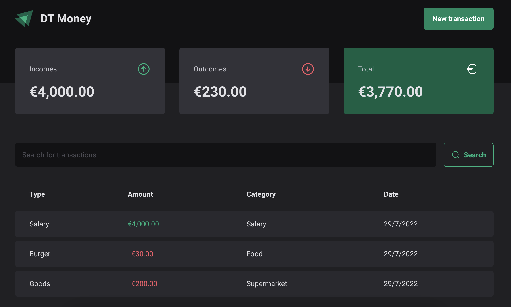

<h1 align='center'>A financial application to study React<h1>

<p align="center">
  
</p>

# :pushpin: Contents

- [Features](#zap-features)
- [Getting started](#runner-getting-started)
- [Technologies](#hammer_and_wrench-technologies)
- [License](#closed_book-license)

<br>

## :zap: Features

- Add incomes and outcomes
- Filter incomes/outcomes

### Next features (In Development)
- Remove items from the list
- Add pagination
<br><br>


## :hammer_and_wrench: Technologies

Some of the technologies and tools used:

- [ReactJS](https://reactjs.org/)
- [Styled-components](https://styled-components.com/)
- [Axios](https://github.com/axios/axios)
- [Husky](https://github.com/typicode/husky)
- [Commitlint](https://github.com/conventional-changelog/commitlint)
- [Lint-staged](https://github.com/okonet/lint-staged)
<br>

## :runner: Getting started

**You need to install [Node](https://nodejs.org/en/).**

Follow the steps bellow:

```bash
# Open a terminal and copy this repository with the command
$ git clone git@github.com:mateussvictor/dt-money.git

# Enter the directory with
$ cd dt-money

# Install dependencies
$ npm install

# Run JSON server:
$ npm run dev:server

# Run the application:
$ npm run dev

```
